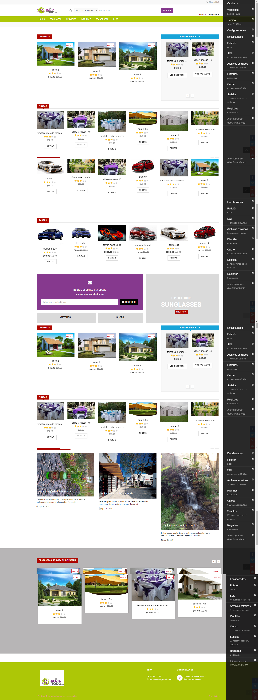
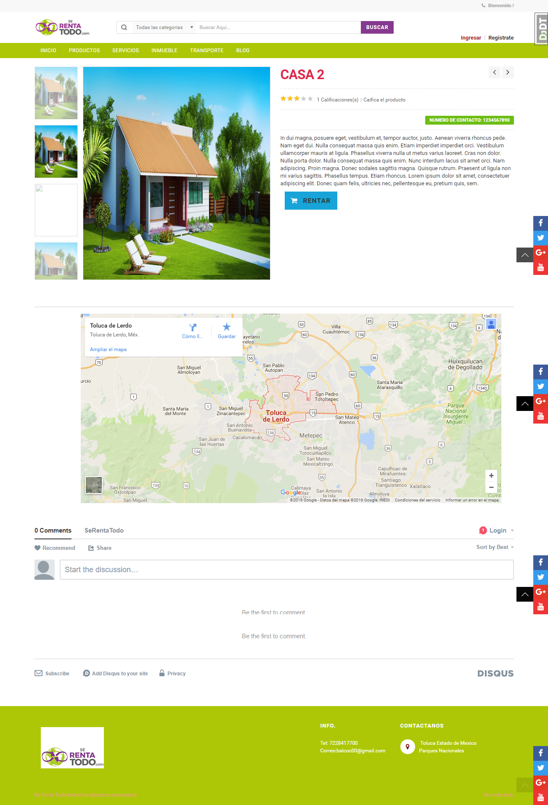
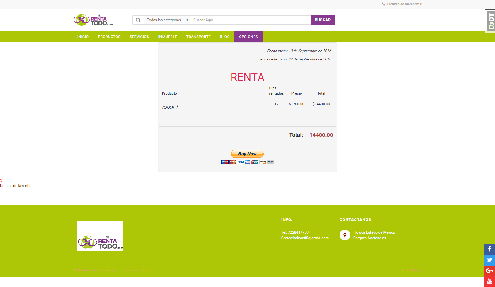
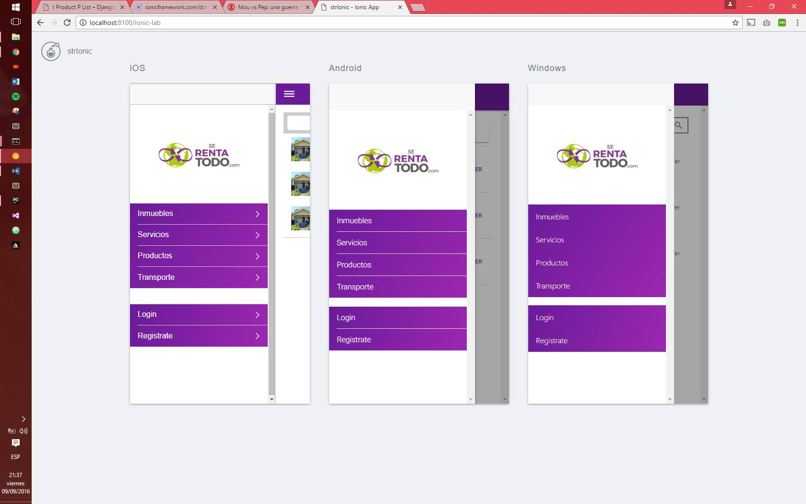
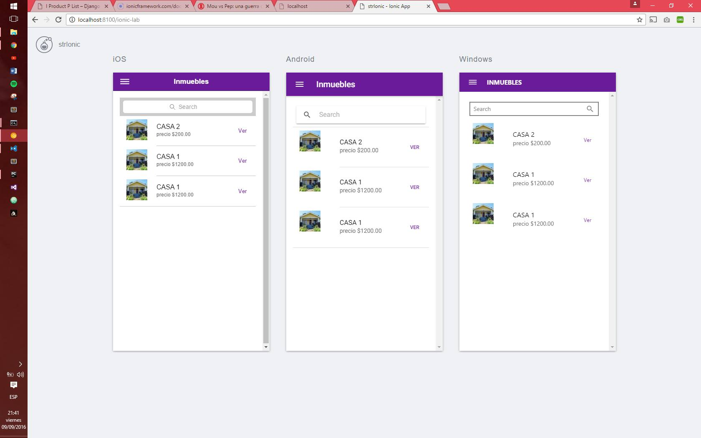
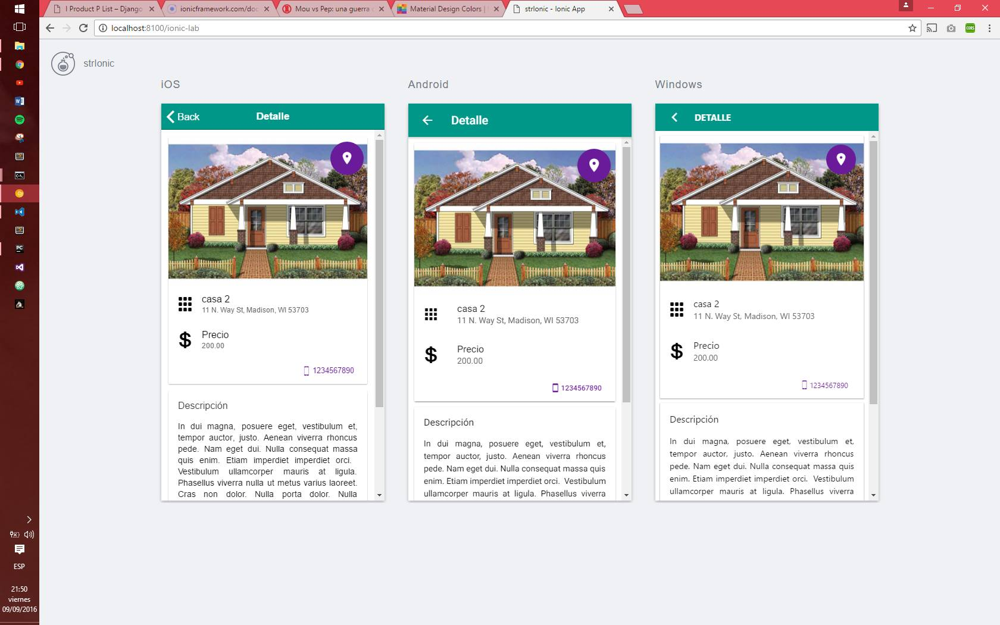

"str sistema para rentar servicios y productos" 
Desarrollo usando django 1.8 
 
 >Caracteristicas
 
 
* aplicaciones moviles android, ios y windowsmobile construidas con ionic2 consumiendo el rest
* Login con redes sociales
* Palidacion de usuario mediante email, recuperacion de cuenta via email
* Pago con paypal
* Blog
* Sistema de comentarios mediante disqus
* Uso de Google Maps
* Crear, Eliminar, Actuaizar Productos
* Historial de rentas
* Crear, Eliminar, Actuaizar Productos
* Agregar Mis favortios
* api rest
 
 > index

---
> detalle producto

> total a pagar de la  renta

> panel movil

> lista de productos  movil

> detalle del producto
